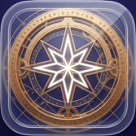

# Dharma

> **"Cosmic Law, Destiny, Right Path"**
> Awakening in action.



## 🌌 Philosophy

**Dharma** (Sanskrit) signifies the eternal law of the cosmos, one's inherent duty, and the path to righteousness. It parallels the Taoist concept of "The Way," the Christian notion of "Redemption," and the metaphysical goal of transcending the cycle of Samsara.

In the modern context, Dharma is a map out of entropy. Our lives are often consumed by chaos, anxiety, and disorder. This system is designed to liberate you from this chaotic state through rigorous planning and execution.

**The Concept of "Xíng Jì" (行纪)**:
*   **Action (行)**: Enlightenment is found not in contemplation alone, but in the fire of action.
*   **Order (纪)**: Creating structure within the chaotic flow of time.

The system is built on 5 fundamental layers:

1.  **Excavate (The Past)**: Uncover your "Anti-Vision" (your personal hell) and excavate your true values through Socratic questioning and psychological archaeology.
2.  **Orient (The Future)**: Define your North Star. Structure your ambitions into a coherent Goal Pyramid (Decade → Year → Quarter → Week).
3.  **Execute (The Present)**: Enter "Monk Mode". High-intensity Deep Work sessions with flow state enforcement, distraction blocking, and binaural focus aids.
4.  **Feedback (The Loop)**: Cybernetic review. Analyze the gap between what you said you would do and what you actually did.
5.  **Evolve (The Identity)**: Gamified growth. Earn XP, level up your identity, and consolidate your new behaviors into permanent traits.

## 🛠 Technology Stack

Built for the future of iOS development.

-   **Platform**: iOS 26+ (Swift 6 Concurrency)
-   **UI Framework**: SwiftUI (Declarative, Animation-driven)
-   **Architecture**: **TCA** (The Composable Architecture) v1.x
-   **Data Persistence**: **SwiftData** (Schema-driven, CloudKit synced)
-   **Intelligence**: **Local-First AI** (Ollama/CoreML) with Cloud Fallback (OpenAI/Deepseek).
-   **Design System**: Custom "Mystical Glassmorphism" aesthetic.

## ✨ Key Features

-   **Anti-Vision Workshop**: A guided workshop to define what you *don't* want, using inversion to find your path.
-   **Goal Pyramid**: A haptic, zoomable interface to connect long-term vision with weekly milestones.
-   **Deep Work Timer**: A specialized focus timer with "Flow State" tracking, recovery modes, and rigid enforcement.
-   **Socratic AI Coach**: An integrated AI (The Orb) that questions your excuses and helps you close the Say/Do gap.
-   **XP & Leveling**: A rigorous RPG system where you gain XP for consistency and lose it for betrayal of your word.

## 🚀 Getting Started

### Prerequisites
-   Xcode 16.0+
-   iOS 18.0+ Simulator/Device
-   (Optional) Ollama running locally for AI features.

### Installation
1.  Clone the repository:
    ```bash
    git clone https://github.com/corlin/Dharma.git
    ```
2.  Open `Dharma.xcodeproj`.
3.  Ensure Signing Team is selected.
4.  Build and Run (⌘+R).

## 🎨 Design System

Dharma features a bespoke design system focused on "Aesthetic Ascension":
-   **Typography**: Rounded, humanistic fonts (`.dharmaTitle`, `.dharmaBody`).
-   **Color Palette**: Deep voids (`.backgroundPrimary`), Electric Blue (`.execute`), and Mystical Purple (`.evolve`).
-   **Layout**: Extreme whitespace reduction for maximum information density.

---

*"We do not rise to the level of our goals. We fall to the level of our systems."*
