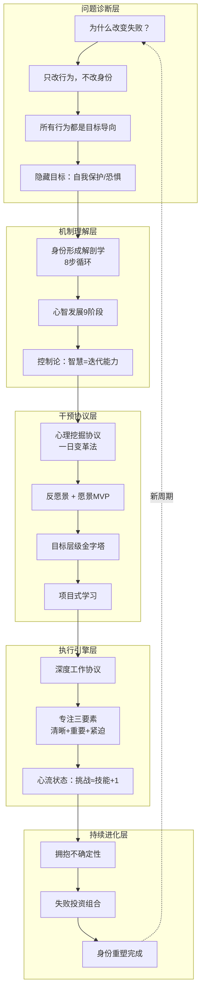
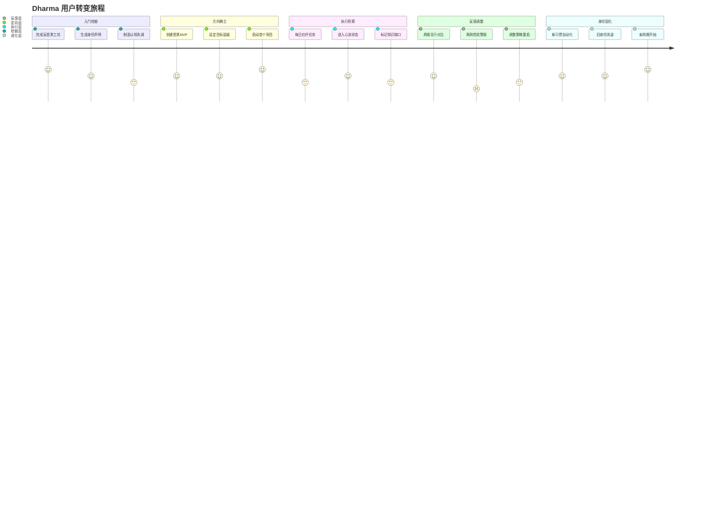

# Dharma App：批判性复盘与深度设计 v2.0

## 一、文档核心逻辑链提炼

通过深度复盘 `docs/1.md`，我识别出文档内在的**因果逻辑链**，这应该成为 App 模块设计的骨架：



---

## 二、初版设计的批判性审视

### 问题1：模块割裂，缺乏有机联系

> [!CAUTION]
> 初版将5个模块并列呈现，但未能体现文档的**核心洞察**——所有模块必须服务于**从旧身份到新身份的转变过程**。

**修正方向**：模块不应是功能清单，而是用户旅程的不同阶段：
- **挖掘** → **定向** → **执行** → **反馈** → **进化**

### 问题2：游戏化生搬硬套

> [!WARNING]
> 初版的游戏化映射（愿景=胜利条件，项目=Boss战）过于表面化，未抓住文档的核心隐喻。

**文档真正的游戏观**（第354-394行）：
- 游戏之所以令人沉迷，是因为它创造了**有序的意识状态**
- 真正的游戏不是外在奖励，而是**让人无法想象其他生活方式**
- 关键在于：挑战略高于技能 → 心流 → 行为自动化 → 成为身份

### 问题3：忽视"身份防御"的核心障碍

> [!IMPORTANT]
> 文档反复强调（第101行、116-122行）：**身份受威胁时会触发战斗/逃跑反应**。这是用户最大的阻力来源。

App 必须设计机制来**温和突破身份防御**，而非假设用户会主动配合。

### 问题4：缺乏"消失"机制

文档第713-723行明确指出：
> "Next, disappear. Not from life, but from what is binding you to your old ways."

初版完全忽略了这个关键步骤——用户需要工具来**识别和切断**绑定他们到旧习惯的人、事、物。

### 问题5："三种工作类型"未被整合

文档第428-432行定义了三种工作：
- **构建**：高强度的深度工作
- **维护**：系统化的重复工作  
- **恢复**：默认模式网络激活的创意休息

初版只关注"构建"，忽略了"恢复"的关键性——**最好的洞察往往在休息时出现**。

---

## 三、重构后的系统架构

### 核心理念：**身份转变旅程 (Identity Transformation Journey)**

App 不是功能集合，而是一条从 **旧身份** 到 **新身份** 的转变路径。

```
┌─────────────────────────────────────────────────────────────────────┐
│                        DHARMA 系统架构                               │
├─────────────────────────────────────────────────────────────────────┤
│                                                                     │
│   ┌─────────────┐    ┌─────────────┐    ┌─────────────┐            │
│   │  挖掘层     │───▶│  定向层     │───▶│  执行层     │            │
│   │ EXCAVATE    │    │ ORIENT      │    │ EXECUTE     │            │
│   └─────────────┘    └─────────────┘    └─────────────┘            │
│          │                  │                  │                    │
│          ▼                  ▼                  ▼                    │
│   ┌──────────────────────────────────────────────────┐             │
│   │              反馈层 FEEDBACK                      │             │
│   │         控制论循环：感知 → 对比 → 调整             │             │
│   └──────────────────────────────────────────────────┘             │
│                              │                                      │
│                              ▼                                      │
│   ┌──────────────────────────────────────────────────┐             │
│   │              进化层 EVOLVE                        │             │
│   │         身份固化 / 阶段跃迁 / 新周期启动           │             │
│   └──────────────────────────────────────────────────┘             │
│                                                                     │
└─────────────────────────────────────────────────────────────────────┘
```

---

## 四、模块钩稽关系详细设计

### 层级1：挖掘层 (EXCAVATE)

**目的**：揭示隐藏目标，制造认知失调，打破身份防御

| 组件 | 功能 | 与其他层的钩稽 |
|-----|-----|---------------|
| **反愿景工坊** | 5年/10年/终身的黑暗投射 | → 生成"赌注"供游戏化层使用 |
| **行为侦探** | 分析用户行为，推断隐藏目标 | → 反馈层对比"说的"vs"做的" |
| **身份考古** | "我是那种...的人"问卷 | → 进化层追踪身份声明变化 |
| **痛点日志** | 每日记录不满/抱怨 | → 执行层识别需要移除的干扰 |

**关键机制**：
```
用户抱怨 → 系统追问"如果观察你的行为，别人会认为你想要什么？" 
→ 认知失调 → 打开改变的窗口
```

---

### 层级2：定向层 (ORIENT)

**目的**：建立目标层级，创造感知透镜，明确攻击方向

| 组件 | 功能 | 与其他层的钩稽 |
|-----|-----|---------------|
| **愿景MVP** | 可演进的理想生活描述 | ← 挖掘层的反愿景反向推导 |
| **目标金字塔** | 10年→1年→季度→周→日 | → 执行层的任务来自最底层 |
| **项目工坊** | 将目标转化为可执行项目 | → 执行层的深度工作必须绑定项目 |
| **技能缺口图** | 当前技能 vs 目标要求 | → 执行层的学习任务优先级 |
| **消失清单** | 需要切断的绑定（人/事/物） | ← 挖掘层的痛点日志分析 |

**钩稽示例**：
```
反愿景（10年后的周二）
    ↓ 反向
愿景MVP（3年后的周二）
    ↓ 分解
年度目标（今年必须发生的一件事）
    ↓ 分阶段
季度项目（可交付物）
    ↓ 任务化
本周里程碑
    ↓ 行动化
今日杠杆任务
```

---

### 层级3：执行层 (EXECUTE)

**目的**：进入心流状态，完成高杠杆任务，积累行为证据

| 组件 | 功能 | 与其他层的钩稽 |
|-----|-----|---------------|
| **深度工作会话** | 三工作类型切换：构建/维护/恢复 | ← 定向层决定今日工作类型 |
| **心流校准器** | 任务难度 vs 当前技能评估 | → 反馈层记录心流进入/退出 |
| **干扰防护罩** | 屏蔽通知，记录干扰来源 | ← 定向层的消失清单 |
| **恢复模式** | DMN激活：散步/冥想/发呆 | → 挖掘层的灵感捕捉 |
| **即时学习** | 遇到知识缺口时标记 | ← 定向层的技能缺口图 |

**三种工作类型的系统支持**：

```
┌─────────────────────────────────────────────────────────────┐
│                     每日工作节奏                             │
├─────────────────────────────────────────────────────────────┤
│                                                             │
│  早晨（高能量）         下午（中能量）        晚间（恢复）    │
│  ┌───────────┐       ┌───────────┐       ┌───────────┐     │
│  │  构建     │       │  维护     │       │  恢复     │     │
│  │  BUILD    │  ───▶ │  MAINTAIN │  ───▶ │  RECOVER  │     │
│  │  深度工作  │       │  系统任务  │       │  DMN激活  │     │
│  └───────────┘       └───────────┘       └───────────┘     │
│       ↑                                        │            │
│       └────────── 灵感/洞察 ◀──────────────────┘            │
│                                                             │
└─────────────────────────────────────────────────────────────┘
```

---

### 层级4：反馈层 (FEEDBACK)

**目的**：实现控制论循环，从失败中学习，保持航向

| 组件 | 功能 | 与其他层的钩稽 |
|-----|-----|---------------|
| **控制论仪表盘** | 目标 → 当前 → 差距 → 调整 | ← 定向层目标 + 执行层行为 |
| **两周检验规则** | 2周无进展 = 错误杠杆警报 | → 定向层重新评估项目 |
| **失败投资组合** | 记录所有失败，提取学习 | → 进化层的成长证据 |
| **言行对比器** | "我说的" vs "我做的" | ← 挖掘层身份声明 + 执行层行为 |
| **觉察打断器** | 随机时间推送反思问题 | → 挖掘层的深层动机分析 |

**控制论核心循环**：

```
          ┌─────────────────────────────────────┐
          │                                     │
          ▼                                     │
    ┌──────────┐     ┌──────────┐     ┌──────────┐
    │  目标    │────▶│  行动    │────▶│  感知    │
    │  GOAL    │     │  ACT     │     │  SENSE   │
    └──────────┘     └──────────┘     └──────────┘
          ▲                                │
          │           ┌──────────┐         │
          └───────────│  对比    │◀────────┘
                      │  COMPARE │
                      └──────────┘
                           │
                           ▼
                    差距分析 + 调整建议
```

---

### 层级5：进化层 (EVOLVE)

**目的**：固化新身份，触发阶段跃迁，开启新周期

| 组件 | 功能 | 与其他层的钩稽 |
|-----|-----|---------------|
| **身份固化追踪** | 新行为 → 习惯 → 身份的进程 | ← 执行层的行为数据 |
| **阶段评估器** | 基于9阶段模型的心智等级 | ← 反馈层的综合数据 |
| **新周期启动器** | 当旧目标达成，触发新挖掘 | → 挖掘层的新一轮探索 |
| **身份声明演进** | 追踪"我是那种...的人"变化 | ← 挖掘层 + 反馈层 |

**身份固化的5个信号**：

1. 不需要"自律"去做这件事
2. 不做这件事反而需要努力
3. 这件事成为"无法想象其他方式"
4. 旧习惯开始令人"恶心"
5. 新身份声明感觉"自然"

---

## 五、跨层钩稽矩阵

| 上游层 | 下游层 | 数据流 | 触发条件 |
|-------|--------|--------|---------|
| 挖掘→定向 | 反愿景 → 愿景MVP | 反向推导 | 完成反愿景工坊后 |
| 挖掘→执行 | 痛点日志 → 消失清单 | 识别干扰源 | 同一干扰出现3次 |
| 定向→执行 | 目标金字塔 → 每日杠杆 | 任务分解 | 每日晨启动 |
| 执行→反馈 | 完成记录 → 进度对比 | 实时同步 | 每次任务完成 |
| 反馈→挖掘 | 言行差距 → 隐藏目标分析 | 周期触发 | 周报生成时 |
| 反馈→定向 | 两周检验 → 项目调整 | 警报触发 | 2周无显著进展 |
| 反馈→进化 | 失败投资 → 成长证据 | 累积计算 | 失败记录满10条 |
| 进化→挖掘 | 新周期启动 → 新反愿景 | 循环重启 | 主要目标达成时 |

---

## 六、用户旅程的关键钩稽点



---

## 七、核心数据模型（修订版）

```typescript
// 用户核心实体
interface User {
  id: string;
  currentMindStage: MindStage; // 1-9阶段
  activeIdentityStatement: string; // "我是那种...的人"
  antiVision: AntiVision;
  visionMVP: VisionMVP;
}

// 反愿景实体 - 与愿景MVP形成对照
interface AntiVision {
  fiveYearTuesday: string;      // ← 挖掘层生成
  tenYearTuesday: string;
  lifetimeCost: string;
  compressedStatement: string;  // → 游戏化层的"赌注"
  roleModel: string;            // 谁已经在这条路上？
}

// 愿景实体 - 从反愿景反向推导
interface VisionMVP {
  threeYearTuesday: string;     // ← 从反愿景反向推导
  requiredBelief: string;       // 需要相信什么才能自然？
  compressedStatement: string;  // → 游戏化层的"胜利条件"
  evolutionHistory: string[];   // 追踪愿景如何演进
}

// 目标层级 - 层层钩稽
interface GoalHierarchy {
  decadeGoal: Goal;             // 方向锚点
  yearGoal: Goal;               // → 任务来源
  quarterProject: Project;      // → 深度工作对象
  weekMilestone: Milestone;     // → 每日任务分解
  dailyLevers: DailyTask[];     // → 执行层输入
}

// 项目实体 - 连接目标与技能
interface Project {
  id: string;
  linkedGoal: string;           // ← 从哪个目标分解
  skillGaps: SkillGap[];        // → 学习任务来源
  milestones: Milestone[];      // → 进度追踪
  inspirationSources: string[]; // 3-5个模仿对象
}

// 控制论反馈实体
interface CyberneticFeedback {
  goal: string;                 // ← 定向层
  currentPosition: string;      // ← 执行层
  gap: string;                  // 计算得出
  adjustment: string;           // AI建议
  twoWeekCheck: boolean;        // 两周检验
}

// 失败投资组合
interface FailurePortfolio {
  failures: Failure[];
  totalInvestment: number;      // 失败次数
  extractedLearnings: string[]; // AI提取的学习
  successPrediction: number;    // 基于失败积累的成功概率
}

// 身份进化追踪
interface IdentityEvolution {
  initialStatement: string;     // 初始身份声明
  currentStatement: string;     // 当前身份声明
  evidenceLog: Evidence[];      // 行为证据
  consolidationLevel: number;   // 0-100% 固化程度
  automaticBehaviors: string[]; // 已自动化的行为
}
```

---

## 八、已确认设计决策 ✅

> [!NOTE]
> 以下设计决策已于 2026-01-19 确认：

### 1. 认知失调的强度控制

**决策：温和引导模式**

- 采用渐进式引导，逐步加深用户的自我觉察
- 不直接呈现最痛苦的反愿景问题，而是层层递进
- 让用户在安全的心理空间中主动探索
- 设计原则：尊重用户节奏，避免造成心理抵触

**实现要点**：
- 反愿景工坊分多个session，每次探索一个维度
- 提供"暂停反思"选项，用户可随时保存进度
- 使用引导性问题而非直接陈述

---

### 2. "消失"功能的实现方式

**决策：仅识别干扰源**

- App 帮助用户识别和记录绑定他们的人、事、物
- 不提供自动切断或屏蔽工具
- 由用户自行决定如何处理这些干扰源
- 设计原则：赋能而非控制

**实现要点**：
- 痛点日志自动分析重复出现的干扰模式
- 生成"消失清单"供用户参考
- 提供反思问题："这个干扰源给你带来了什么？失去它会付出什么代价？"

---

### 3. AI 的角色定位

**决策：沉默观察 + 苏格拉底式提问（混合模式）**

- 默认状态：沉默观察，收集数据，被动呈现洞察
- 关键时刻：通过提问引导用户思考，而非直接给答案
- 不主动干预用户行为，尊重用户自主权
- 设计原则：AI 是镜子和向导，不是老板

**实现要点**：
- AI 不主动推送通知，除非是用户设定的觉察打断
- 当检测到言行差距时，以问题形式呈现：
  - "你说你想X，但这周的数据显示你大部分时间在Y。这让你想到什么？"
- 周报以问题结尾，引导用户自己得出结论

**苏格拉底式提问库示例**：
```
- "如果观察你过去一周的行为，别人会认为你想要什么？"
- "这个选择背后，你在保护什么？"
- "如果10年后的你看到今天的决定，他/她会说什么？"
- "这件事对你来说真的重要，还是你认为它应该重要？"
- "如果不需要向任何人证明自己，你会做什么不同的选择？"
```

---

### 4. 失败投资组合的可视化

**决策：XP 经验值隐喻**

- 每次失败 = 获得 XP
- XP 累积解锁"成长等级"
- 将失败重新框架为游戏中的必要经验积累
- 设计原则：失败不是损失，而是成功的燃料

**实现要点**：
- 失败记录后，系统自动奖励 XP
- XP 计算规则：
  - 基础失败：+10 XP
  - 记录学习：+20 XP（额外）
  - 应用学习到下次尝试：+30 XP（额外）
- 等级系统与心智发展9阶段呼应
- 可视化进度条："距离下一次突破还需 XX XP"

**XP 系统与心智阶段的映射**：

| 等级 | XP 范围 | 对应心智阶段 | 解锁内容 |
|-----|---------|------------|---------|
| 新手 | 0-100 | 觉察期 | 基础功能 |
| 探索者 | 100-500 | 自律期 | 高级反思工具 |
| 实践者 | 500-1500 | 个体化期 | 定制化仪表盘 |
| 战略家 | 1500-5000 | 战略期 | 元认知工具 |
| 大师 | 5000+ | 建构觉察期 | 导师功能（帮助他人） |

---

## 九、设计决策汇总图

```
┌─────────────────────────────────────────────────────────────────────┐
│                    Dharma 设计决策框架                              │
├─────────────────────────────────────────────────────────────────────┤
│                                                                     │
│  ┌───────────────────┐         ┌───────────────────┐               │
│  │  认知失调强度      │         │  AI 角色定位       │               │
│  │  ✓ 温和引导       │         │  ✓ 沉默观察        │               │
│  │  × 激进模式       │         │  ✓ 苏格拉底提问    │               │
│  │  × 用户自选       │         │  × 主动干预        │               │
│  └───────────────────┘         └───────────────────┘               │
│                                                                     │
│  ┌───────────────────┐         ┌───────────────────┐               │
│  │  消失功能         │         │  失败可视化        │               │
│  │  ✓ 仅识别干扰     │         │  ✓ XP 经验值       │               │
│  │  × 工具切断       │         │  × 投资账户        │               │
│  │  × 社交脱钩       │         │  × 科学家假设      │               │
│  └───────────────────┘         └───────────────────┘               │
│                                                                     │
│  核心设计理念：                                                     │
│  「尊重用户自主权 · 赋能而非控制 · AI是镜子不是老板」               │
│                                                                     │
└─────────────────────────────────────────────────────────────────────┘
```

---

## 十、下一步

1. ✅ 完成批判性复盘
2. ✅ 用户确认4项设计决策
3. ⏳ 创建详细 UI/UX 设计规范
4. ⏳ 技术架构设计
5. ⏳ 原型开发（暂缓）
