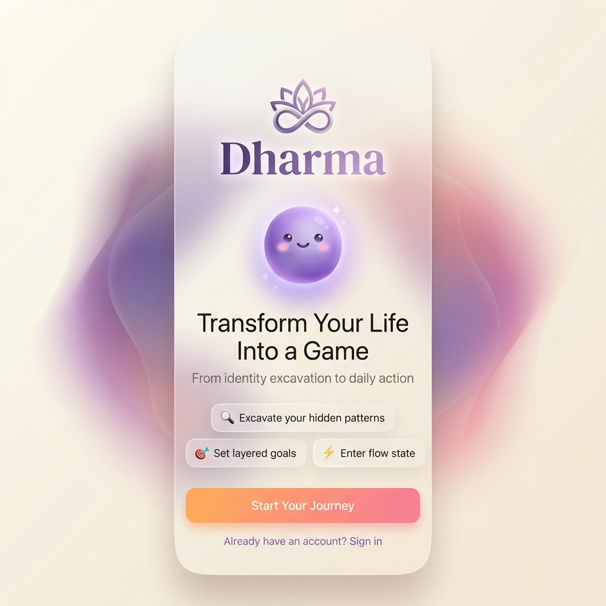
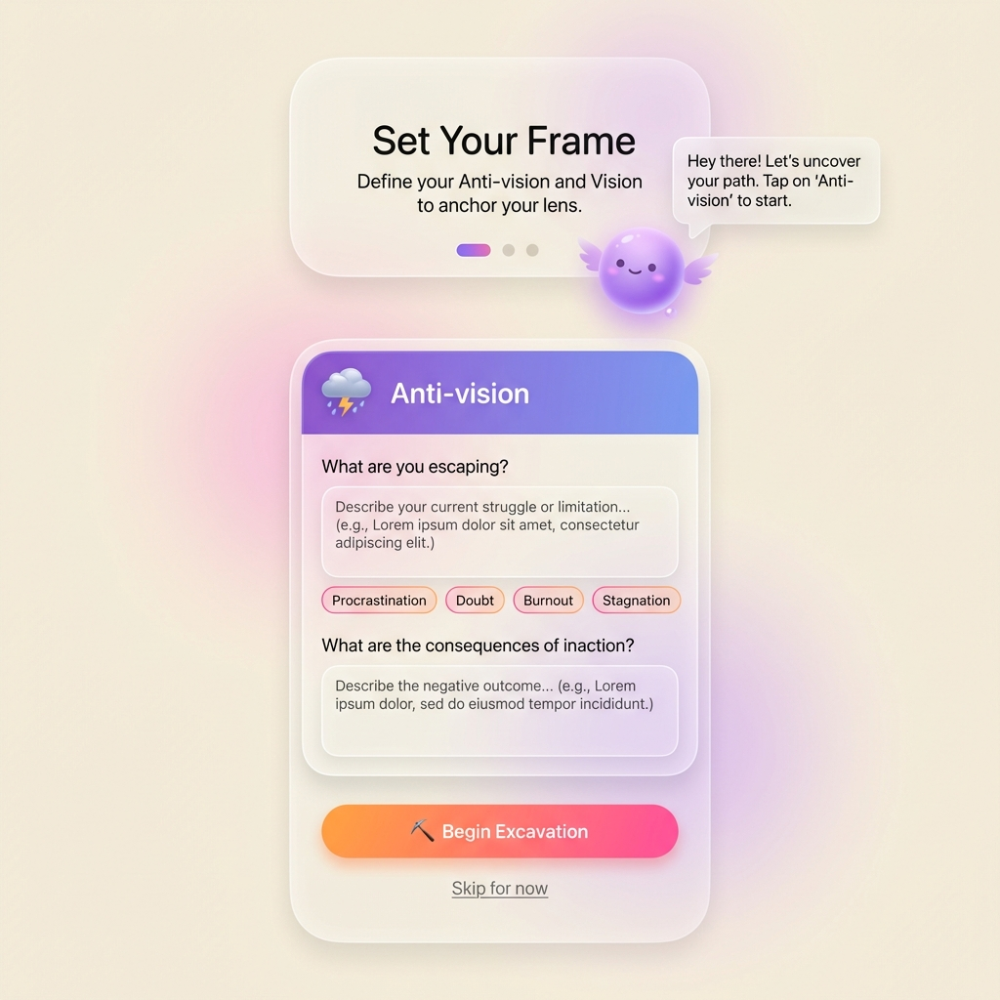
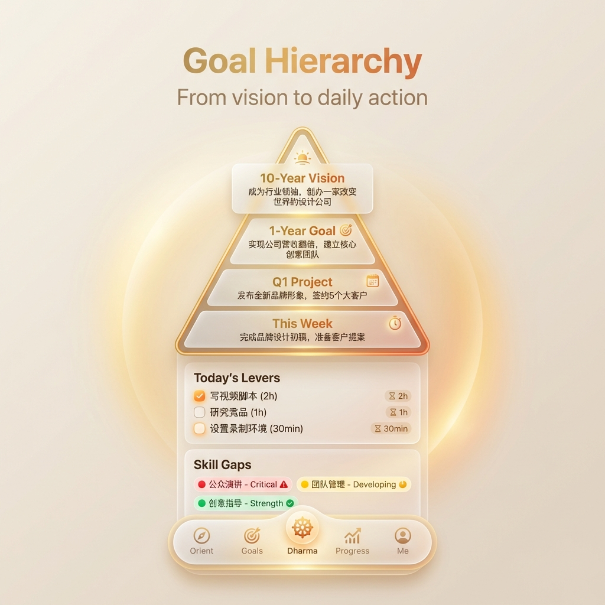
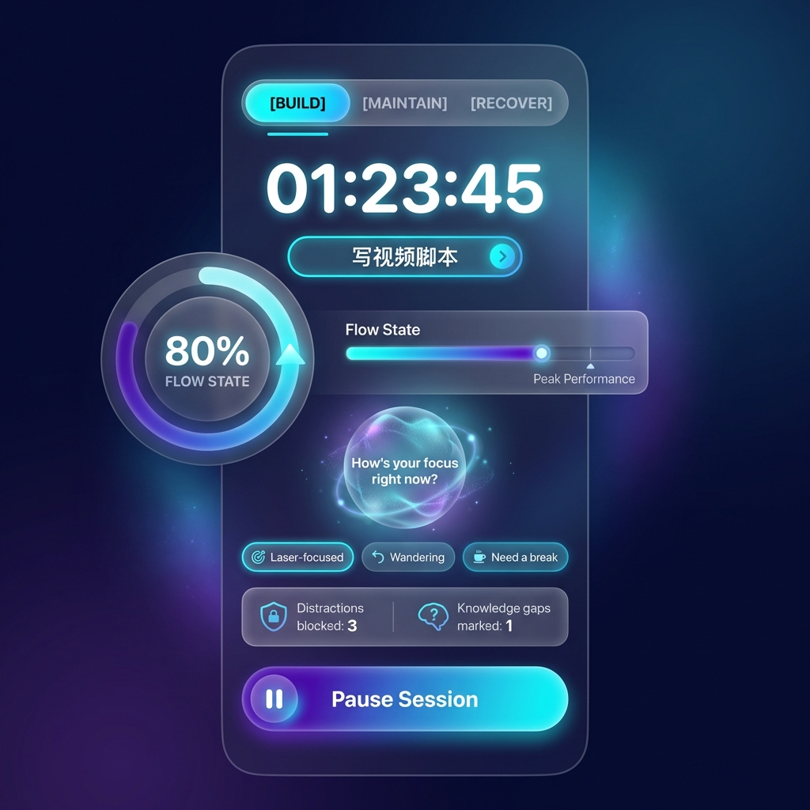
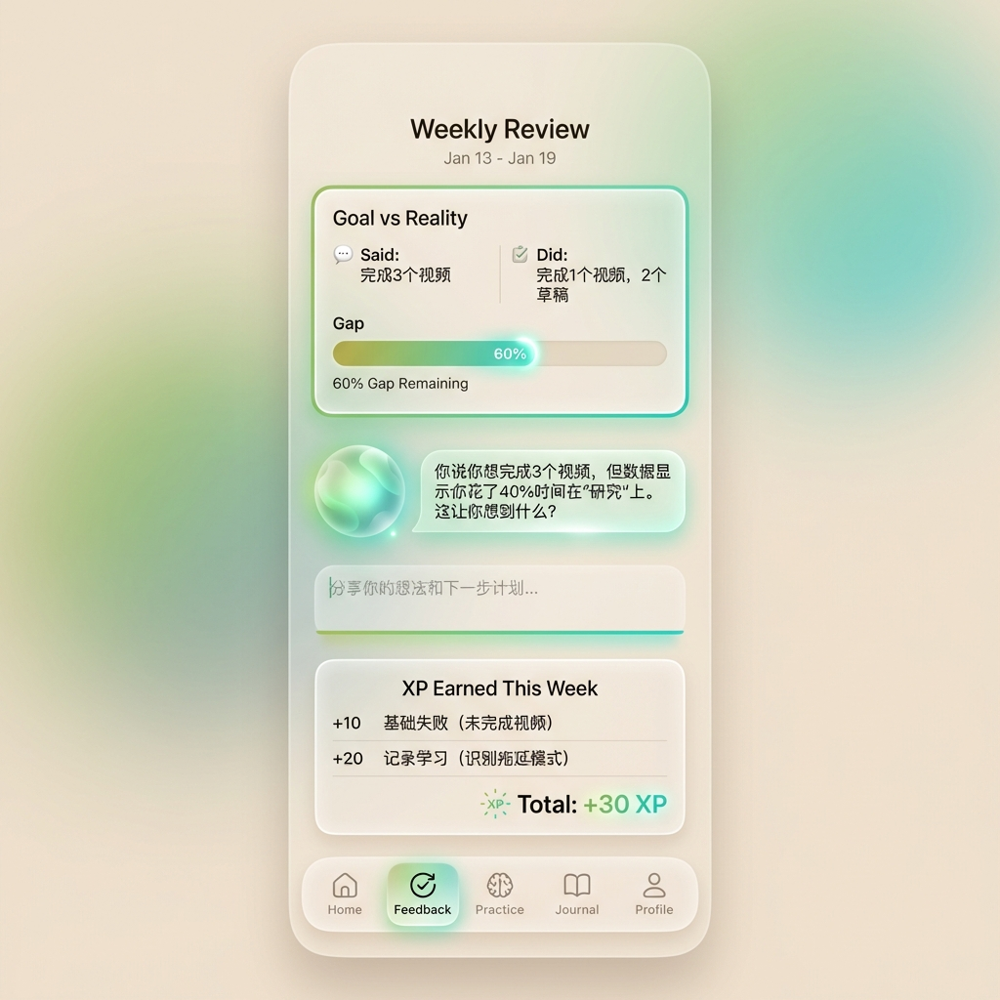
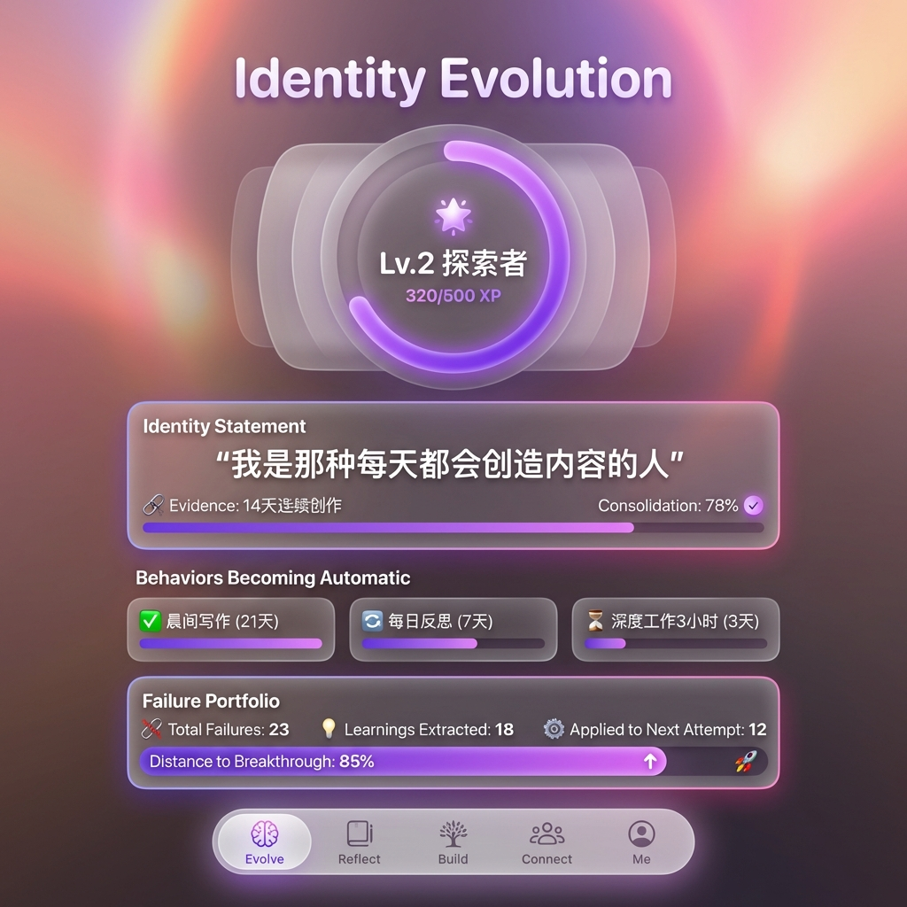
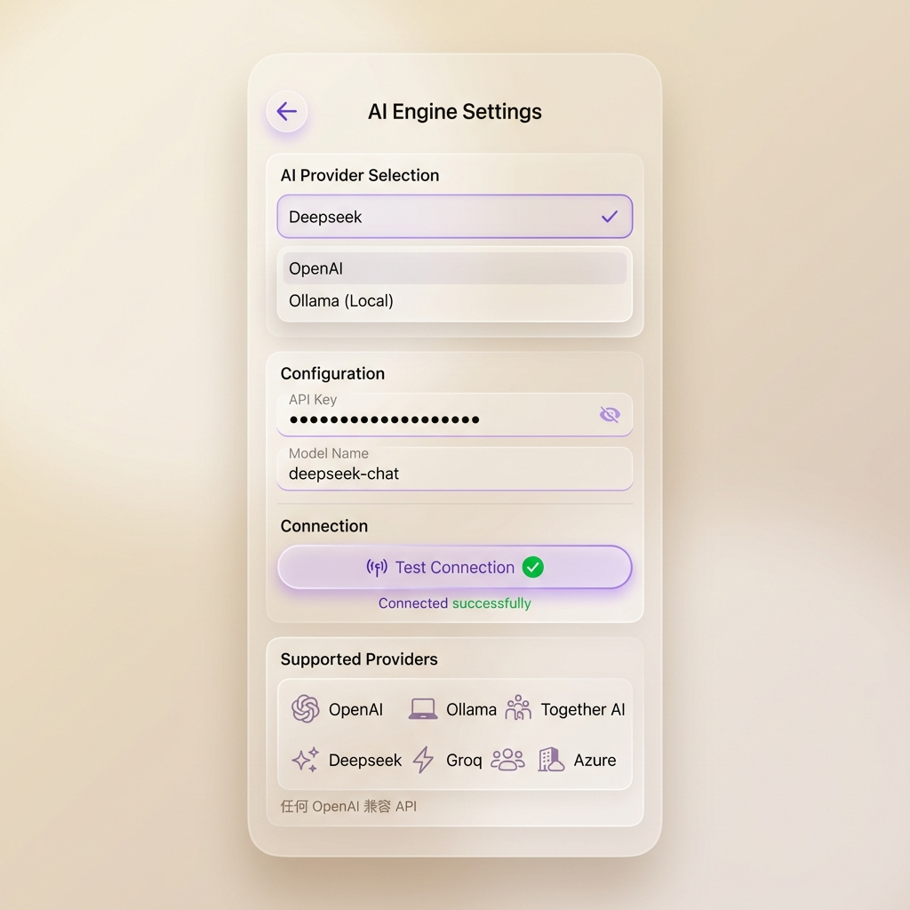

# Dharma App 原型设计展示

> 基于 iOS 26 Human Interface Guidelines  
> 设计日期：2026-01-19

---

## 设计概览

本文档展示 Dharma App 的核心界面原型设计，涵盖从用户入门到日常使用的完整旅程。

### 设计语言特点

| 元素 | 规范 |
|-----|-----|
| 背景 | 温暖米白色 + 柔和光晕效果 |
| 卡片 | 毛玻璃效果（Glassmorphism） |
| 色彩 | 紫色品牌主色 + 功能层级渐变 |
| 字体 | SF Pro Rounded |
| 角色 | Orb - 可爱的 3D 紫色球形 AI 向导 |

---

## 1. 欢迎页 (Onboarding)

**用户首次打开 App 看到的界面**



**设计亮点**：
- 🪷 莲花符号 Logo，象征觉醒与转变
- 🔮 Orb 角色首次亮相，建立情感连接
- ✨ "Transform Your Life Into a Game" 核心价值主张
- 🎯 三大功能预览：挖掘、目标、心流
- 🌈 橙粉渐变 CTA 按钮，邀请开始旅程

---

## 2. 挖掘层 - 反愿景工坊 (EXCAVATE)

**帮助用户揭示隐藏的恐惧和逃避模式**



**设计亮点**：
- 📍 步骤指示器（3步中的第1步）
- 💬 Orb 提供温和的引导语
- 🌧️ 紫蓝渐变卡片头部，视觉区分"Anti-vision"
- 🏷️ 快速标签选择：拖延症、怀疑、倦怠、停滞
- ✍️ 开放式文本输入，鼓励深度反思
- ⛏️ "Begin Excavation" 行动号召

**对应功能模块**：
- 反愿景工坊（5年/10年投射）
- 痛点日志
- 身份考古

---

## 3. 定向层 - 目标金字塔 (ORIENT)

**将愿景分解为可执行的层级目标**



**设计亮点**：
- 🔺 视觉化金字塔结构：10年→1年→季度→本周
- 📋 "Today's Levers" 每日任务清单
- ⏱️ 每个任务显示预估时间
- 🚥 技能缺口指示器（红/黄/绿）
- 🧭 底部浮动导航栏（5个主标签）

**对应功能模块**：
- 愿景 MVP
- 目标分解器
- 项目工坊
- 消失清单

---

## 4. 执行层 - 深度工作会话 (EXECUTE)

**沉浸式专注模式，追踪心流状态**



**设计亮点**：
- 🌙 深色主题，减少干扰
- ⏱️ 大字计时器，清晰可见
- 🔄 三工作类型切换：BUILD / MAINTAIN / RECOVER
- 📊 心流状态仪表盘（80%）
- 💬 Orb 实时询问专注状态
- 🏷️ 快速反馈选择："Laser-focused"/"Wandering"/"Need a break"
- 📈 干扰拦截和知识缺口统计

**对应功能模块**：
- 深度工作计时器
- 心流校准器
- 干扰防护罩
- 恢复模式

---

## 5. 反馈层 - 周报 (FEEDBACK)

**言行对比，苏格拉底式反思**



**设计亮点**：
- 📅 时间范围显示（Jan 13 - Jan 19）
- ⚖️ "Goal vs Reality" 对比卡片
- 📊 差距进度条（60%）
- 💬 Orb 提出苏格拉底式问题，不给答案
- ✍️ 反思输入区域
- ⭐ XP 获得详情（失败也是投资！）
- 🎯 总计 +30 XP 高亮显示

**对应功能模块**：
- 控制论仪表盘
- 言行对比器
- 失败投资组合
- 两周检验警报

---

## 6. 进化层 - 身份演进 (EVOLVE)

**追踪身份固化进程，庆祝成长**



**设计亮点**：
- 💜 紫粉渐变光晕，营造庆祝氛围
- 🔮 大型 XP 进度环（Lv.2 探索者，320/500 XP）
- 💬 身份声明展示："我是那种每天都会创造内容的人"
- ✅ 行为自动化追踪（21天/7天/3天）
- 📈 身份固化程度（78%）
- 🚀 失败投资组合统计（23次失败 → 85%接近突破）

**对应功能模块**：
- 身份固化追踪
- 阶段评估器
- XP 等级系统
- 新周期启动器

---

## 7. 设置 - AI 引擎配置

**用户可自由选择 AI 后端**



**设计亮点**：
- 🔧 iOS 原生设置风格
- 📝 提供商下拉选择（OpenAI/Ollama/Deepseek 等）
- 🔐 API Key 安全输入
- ✅ 连接测试按钮 + 状态反馈
- ℹ️ 支持的服务列表展示

**支持的 AI 引擎**：
- OpenAI (GPT-4, GPT-4o)
- Ollama (本地运行)
- Deepseek (高性价比)
- Groq (超快响应)
- Together AI (开源模型)
- Azure OpenAI (企业级)
- 任何 OpenAI 兼容 API

---

## 用户旅程映射

````carousel
### 1️⃣ 入门 → 挖掘

用户从欢迎页开始，了解 App 核心价值，然后进入反愿景工坊，揭示自己的恐惧和逃避模式。


<!-- slide -->
### 2️⃣ 挖掘 → 定向

完成反愿景后，系统反向推导愿景 MVP，用户设定从10年到每日的层级目标。


<!-- slide -->
### 3️⃣ 定向 → 执行

每日从目标金字塔获取"杠杆任务"，进入深度工作会话，追踪心流状态。


<!-- slide -->
### 4️⃣ 执行 → 反馈

深度工作会话结束后，数据自动同步到反馈层，周报生成言行对比。


<!-- slide -->
### 5️⃣ 反馈 → 进化

通过 XP 系统将失败转化为成长，追踪身份固化进程，触发新的成长周期。


````

---

## 设计系统一致性检查

| 检查项 | 状态 |
|-------|-----|
| 毛玻璃效果一致性 | ✅ |
| 品牌色使用 | ✅ 紫色主色贯穿 |
| Orb 角色出现 | ✅ 关键界面都有 |
| 渐变 CTA 按钮 | ✅ 橙粉渐变统一 |
| 圆角规范 | ✅ 16pt 卡片圆角 |
| 深色模式 | ✅ 执行层专用 |
| 底部导航 | ✅ 五层架构对应 |

---

## 下一步

1. ✅ 生成核心界面原型（7张）
2. ⏳ 制作交互原型（Figma/Framer）
3. ⏳ 用户测试与反馈收集
4. ⏳ 迭代优化
5. ⏳ 开发实现
